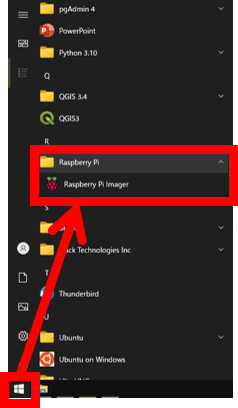

# ブート用イメージの書き込み

ここでは、**可搬型識別装置のデータ（ブート用イメージ）を microSD カードに書き込む方法**を説明します。

作成した microSD カードを装着した Raspberry Pi は、病虫害識別装置として使うことができます。

> ⚠️注意⚠️
>
> ブート用イメージを書き込むと、**microSD カードにあるデータは削除されます**。
> 書き込み前に、カード内のデータを必ず確認してください。

## 用意するもの

* 書き込み作業用の Windows PC
* SDカードリーダ
* microSD カード（32GB以上）

## 書き込み手順

書き込み手順は下記のとおりです。

1. 書き込み用のアプリ（Raspberry Pi Imager）を、PCにインストールする
1. microSD カードを PC に接続する
1. ブート用イメージを microSD に書き込む

### 書き込み用のアプリを PC にインストールする

書き込み作業には、専用のアプリ（Raspberry Pi Imager）を使います。

1. Raspberry Pi の Web サイトにある、アプリの配布ページ (https://www.raspberrypi.com/software/) を開きます。  
1. 「Raspberry Pi Imager」をダウンロードします。  

1. ダウンロードしたファイルを開き、アプリをインストールします。  

### microSD カードを PC に接続する

PC に SD カードリーダを接続し、リーダに microSD カードを挿入します。

> ️📘ノート
>
> microSD の状態によっては、「microSD をフォーマットする必要がある」旨のメッセージが表示されることがありますが、無視してかまいません。
> 
> フォーマットは、書き込みアプリが自動的に実施します。
>
> 

### ブート用イメージを microSD に書き込む

1. スタートメニューから書き込みアプリ「Raspberry Pi Imager」を選んで、アプリを起動します。  

1. 書き込みアプリが起動します。  

1. 「OSを選ぶ」ボタンを押し、一覧の最下部にある「カスタムイメージを使う」を選択します。  

1. ブート用イメージを選択し、「Open」を押します。  

1. 「ストレージを選ぶ」ボタンを押し、書き込み対象の microSD カードを一覧から選択します。  

1. 「書き込む」ボタンを押すと、microSD カードへの書き込みが始まります。

1. 書き込みが終了した旨のメッセージが表示されたら、microSD カードを PC から取り外します。

Raspberry Pi に microSD カードを装着して起動すると、診断装置として使えるようになります。

装置をスマートフォンに接続して診断する方法は、「[診断装置の使い方](./how_to_use.md)」を参照してください。
