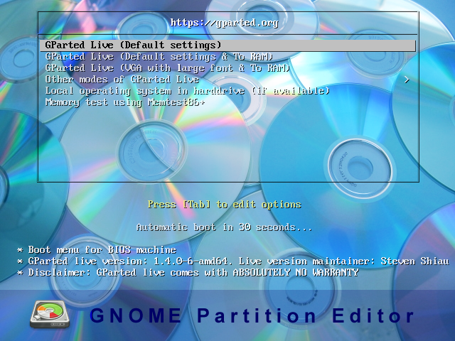
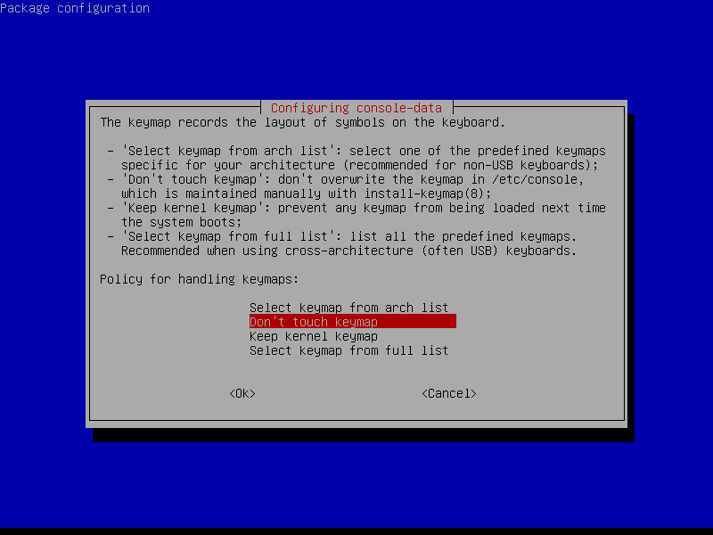
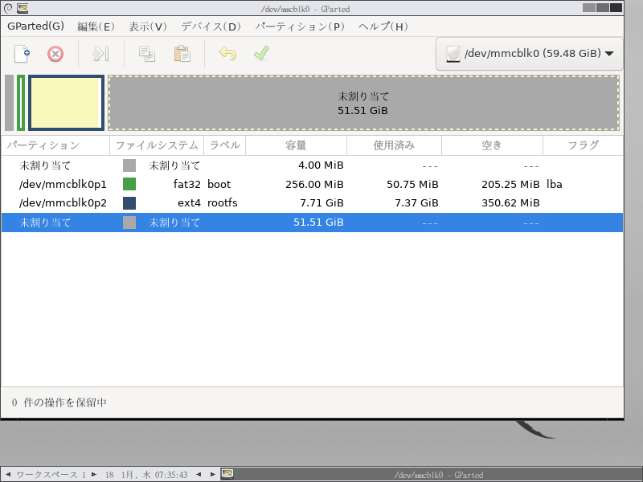
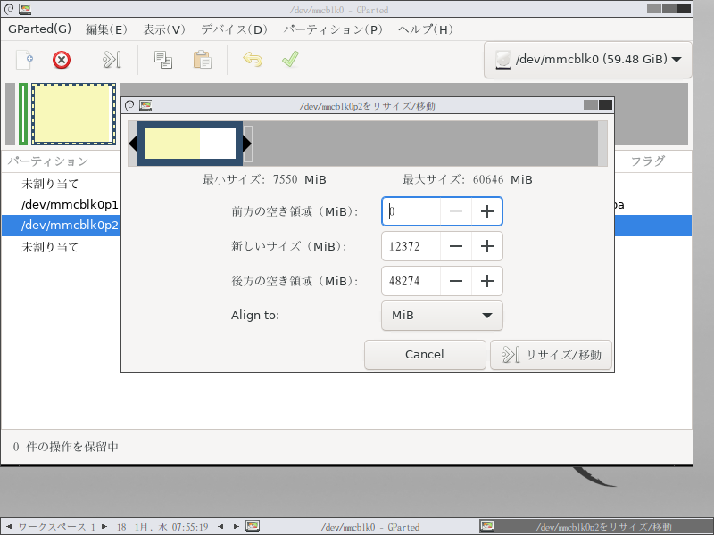
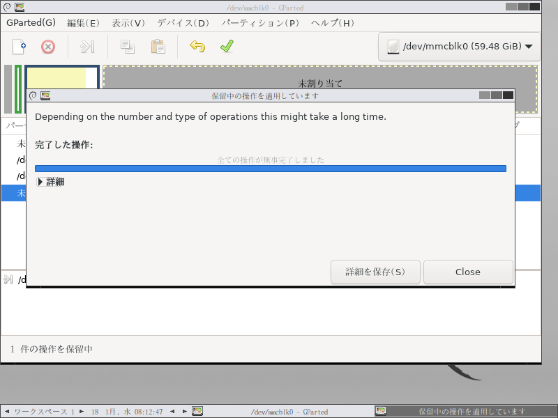

# ブート用イメージの作成手順

ここでは、**可搬型識別装置のブート用イメージを作成する方法**を説明します。

作成したイメージは、 [ブート用イメージの書き込み](./burn_bootable_image.md) に示した手順で microSD カードに書き込むことができます。

> ⚠️注意⚠️
> 
> 操作を誤ると、microSD カード内のデータが壊れて**装置が正しく動作しなくなる**場合があります。
> 
> ブート用イメージを作成する前に、必ずファイルのバックアップをとってください。

## 用意するもの

* 正しく動作する診断装置の microSD カード
* Linux サーバ（ディスクイメージの作成用）
* SD カードリーダ

## microSD カードをサーバに接続する

1. microSD カードを接続する前のデバイス構成を `lsblk` 等のコマンドで確認します。
    ```console
    $ lsblk
    NAME   MAJ:MIN RM   SIZE RO TYPE MOUNTPOINT
    sr0     11:0    1  1024M  0 rom
    sda      8:0    0 465.8G  0 disk
    |-sda2   8:2    0     1K  0 part
    |-sda5   8:5    0    32G  0 part [SWAP]
    `-sda1   8:1    0 433.8G  0 part /
    ```
1. サーバに SD カードリーダを接続し、診断装置の microSD カードを接続します。
1. 再度、デバイス構成を確認します。新たに追加された行が microSD カードです。  
    デバイスの名前（この場合は `mmcblk0`）をメモします。
    ```console
    $ lsblk
    NAME   MAJ:MIN RM   SIZE RO TYPE MOUNTPOINT
    sr0     11:0    1  1024M  0 rom
    sda      8:0    0 465.8G  0 disk
    |-sda2   8:2    0     1K  0 part
    |-sda5   8:5    0    32G  0 part [SWAP]
    `-sda1   8:1    0 433.8G  0 part /
    mmcblk0 10:0    0  59.5G  0 disk
    ```

## ファイルシステムとパーティションを縮小する（オプション）

> 📒ノート
> 
> このステップは、省略してもかまいません。

> ⚠️注意⚠️
> 
> ファイルシステムやパーティションのサイズ変更により、microSD 上のデータが壊れる場合があります。
> 
> 操作の前に、必ずファイルのバックアップをとってください。

### まえがき

microSD カードのディスクイメージを作成する場合、カード上にあるすべてのパーティションをイメージにコピーする必要があります。

このため、例えば 64GB の SD カード上に、カードと同じサイズのパーティションが割り当てられている場合、たとえファイルシステム上の使用容量が 5GB や 10GB だったとしても、64GB のディスクイメージが生成されます。

ファイルシステム上に空き容量がある場合、ファイルシステムとパーティションを縮小することで、生成されるディスクイメージのサイズを小さくすることができます。
この作業は必須ではありませんが、より容量の小さい microSD カードにディスクイメージをコピーすることが可能になります。

### GParted のインストール

ファイルシステムとパーティションを縮小するには、 `gparted` ツールを使用します。

`gparted` は Linux 上で動作するため、下記のいずれかの方法でツールを開いてください。

* Linux サーバが GUI 環境に対応している場合は、サーバに `gparted` をインストールします。
* GUI 環境を備えた Linux サーバがない場合は、Live CD を作成します。
    1. CD ドライブと SD カードリーダを備えた PC を用意します。
    1. [GParted のダウンロードページ](https://gparted.org/download.php) から、GParted の ISO イメージを取得します。
    1. ISO イメージを CD にコピーします。  
    Windows の場合は、ダウンロードしたイメージを右クリックし、「ディスクイメージの書き込み」でCDにコピーできます。
    1. CD を挿入した状態で PC を再起動すると、ツールのメニュー画面が起動します。
    「GParted Live (Default settings)」を選択します。  
    
    1. 設定画面が表示されます。画面の指示に沿って、キーボードレイアウトや言語の設定を行います。  
    
    1. 設定が完了すると、GParted のメイン画面が表示されます。  
    


### ファイルシステム・パーティションの縮小

GParted を起動したら、下記の操作を行います。

1. microSD カードをサーバまたは PC に挿入し、画面右上のデバイス一覧から microSD カードを選択します。  
1. ファイルシステムが ext4 のパーティション（使用されているパーティションのうち2番目）を縮小します。  
    画面上部のグラフィカル表示、または画面下部のパーティション一覧から、パーティションを右クリックして「リサイズ/移動」を選択します。  
    スライダーをドラッグして、パーティションを縮小します。
    
    > 📒ノート
    > 
    > 最小サイズ（ディスクの使用容量）まで縮小せず、1000MiB程度の空き容量をもたせてリサイズしてください。
1. メイン画面のツールバーから適用アイコン（）を選択して、縮小処理を開始します。
    > 📒ノート
    > 
    > ファイルシステムとパーティションの両方が、自動的にリサイズされます。
1. 縮小に成功すると、完了メッセージが表示されるので、GParted ツールを終了します。
    Live CD を使用している場合は、デスクトップの「Exit」をダブルクリックして、シャットダウンします。  
    

## ディスクイメージを作成する

1. `fdisk` を用いて、最終パーティションの最後のセクタ番号を取得します。  
    下記のコマンドを入力します。
    ```console
    $ fdisk -l /dev/mmcblk0
    Device          Boot  Start      End  Sectors  Size  Id Type
    /dev/mmcblk0p1         8192   532479   524288  256M   c W95 FAT32 (LBA)
    /dev/mmcblk0p2       532480 16181247 15648768  7.5G  83 Linux
    ```
    上記の例では、最後尾のセクタ番号は `16181247` です。
1. `dd` コマンドでディスクイメージを作成します。
    * `if` オプション: microSD デバイスのパス（`/dev/mmcblk0` など）
    * `of` オプション: 書き出すディスクイメージのファイルパス
    * `bs` オプション: ブロックサイズ。`512` (512バイト) を指定します。
    * `count` オプション: コピーするブロック数。`fdisk` で取得したセクタ番号に1を足した値を入力します。
    ```console
    # dd if=/dev/mmcblk0 of=./naro_rasppi.img bs=512 count=$((16181247 + 1))
    ```

作成したディスクイメージを microSD に書き込むことで、イメージ作成時と同じディスク構成の microSD カードが作成されます。

以上