# 診断装置の使い方

ここでは、**診断装置を起動・終了する方法**と、**スマートフォンからアプリを開いて病虫害を診断する方法**を説明します。

## 装置の起動と終了

### 装置の電源を入れるには

1. 装置（Raspberry Pi）裏面のカードスロットに、microSD カードを装着します。  

1. 電源ポートに、電源プラグを差し込みます。  
  ※ 電源ポートは、装置の側面にあります。形状は USB Type-C です。  

1. 電源ランプ（基板上の赤いランプ）が点灯し、装置が起動します。  
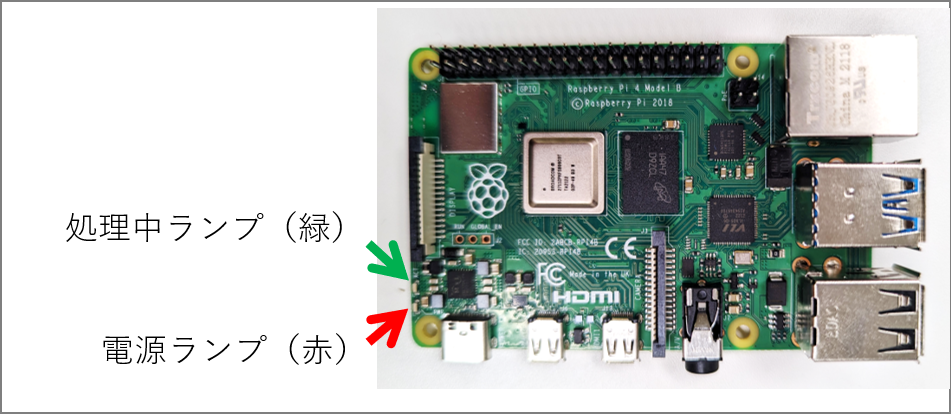
1. 1分ほど待つと、Wi-Fi 接続ができる状態になります。

### 装置の電源を切るには

診断中に電源を切ると、microSDカード上のデータが壊れる可能性があります。診断を行っていないことを確認してから、電源を切ってください。

1. 装置に接続しているスマートフォン上で、診断が行われていないことを確認します。
1. 処理中ランプ（基板上の、緑のランプ）が消灯していることを確認します。

    > ⚠️注意⚠️
    > 
    > 緑のランプが点滅しているときに装置の電源を切ると、microSDカード上のデータが壊れ、
    > **装置が正しく動作しなくなる**場合があります。
    > 
    > 万が一、装置が動作しなくなったら、[ブート用イメージの書き込み](./burn_bootable_image.md) で示した手順に沿って
    > microSD カードにデータを書き込み直してください。

1. 電源プラグを抜きます。
1. 装置の電源が切れて、電源ランプが消灯します。

## スマートフォンから病虫害診断する

### 事前準備: 装置に Wi-Fi 接続する

病虫害診断をする前に、スマートフォンから識別装置に Wi-Fi（無線LAN）接続する必要があります。

> ⚠️注意⚠️
>
> * お使いの端末によっては、ここで示した Wi-Fi の設定手順が当てはまらない場合があります。
> * 識別装置に接続しているあいだは、スマートフォンからインターネットへの接続ができません。  
> Wi-Fi 接続を解除すると、再度インターネットに接続できるようになります。  
> （装置に接続したまま、インターネットに接続することはできません。）

> ️📘ノート
>
> * PC からも、装置に Wi-Fi 接続して診断することができます。

#### Android の場合

1. 「設定」アプリ（⚙アイコン）を開きます。  
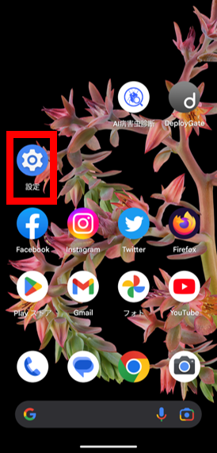
1. 「ネットワークとインターネット」を開きます。  
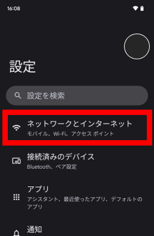
1. 「インターネット」を開きます。  
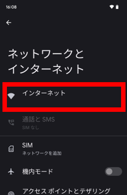
1. 「Wi-Fi」のスイッチがOFFになっているときは、ONにします。  
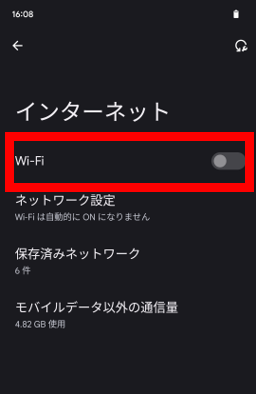
1. 一覧から「`diagnosis_ai`」という名前の項目を選択します。  
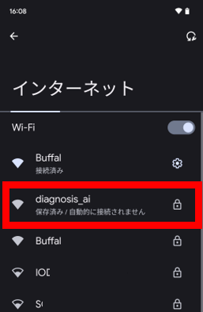
1. はじめて接続するときは、パスワードを入力する必要があります。
別途指定されたパスワードを入力します。  
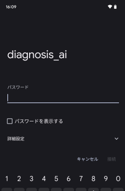
1. 「デバイスに接続されました。」と表示されます。  
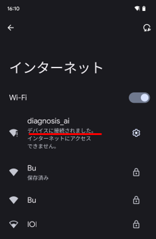

#### iPhone の場合

1. 「設定」アプリ（⚙アイコン）を開きます。
1. 「Wi-Fi」を開きます。
1. 一覧から「`diagnosis_ai`」という名前の項目を選択します。
1. はじめて接続するときは、パスワードを入力する必要があります。
別途指定されたパスワードを入力します。

設定後、「インターネットに接続されていない」というメッセージが表示されることがありますが、
診断には影響しないので、無視してかまいません。

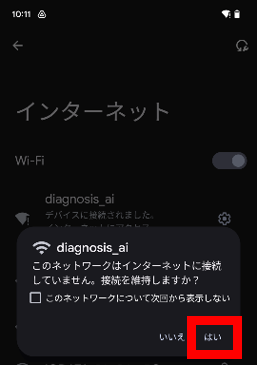

### 診断アプリを使う（簡易版）

診断アプリを使う方法を説明します。

1. ホーム画面から、Google Chrome や Safari などのブラウザアプリを起動します。  
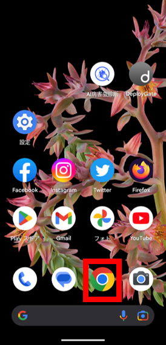
1. アドレスバーに下記を入力して、キーボードの確定キーを押します。  
`http://ai.local`  
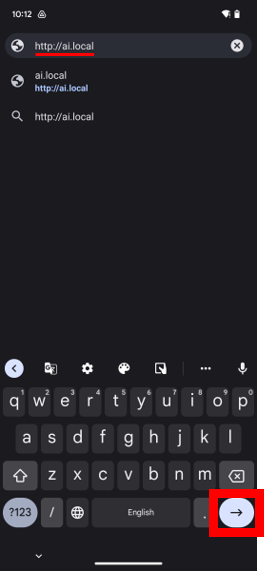

    > ️📘ノート
    >
    > * `http://` も省略せず入力してください。  
    >   （一部のブラウザでは、`http://` を入力しないと正しいアドレスとして認識されません）
    > * `192.168.10.1` を入力してアプリを開くこともできます。

1. 診断アプリが開きます。  
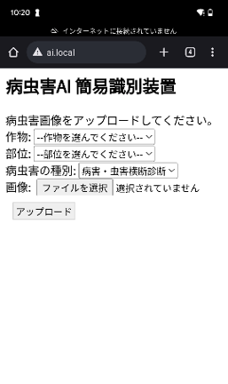
1. 作物・部位・病虫害の種別・画像を選択します。  
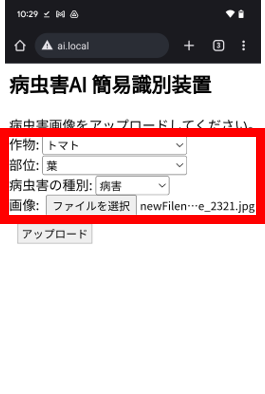
1. 「アップロード」ボタンを押すと、診断がはじまります。  
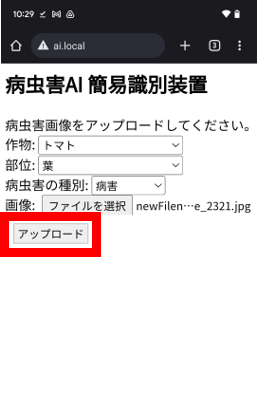
1. 5～10秒ほどで、診断結果が表示されます。  
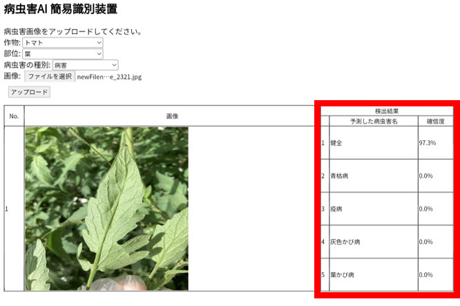

### 診断アプリを使う（高機能版）

1. ホーム画面から、Google Chrome や Safari などのブラウザアプリを起動します。  

1. アドレスバーに下記を入力して、キーボードの確定キーを押します。  
`http://ai.local:8080`  
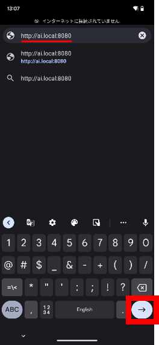

    > ️📘ノート
    >
    > * `http://` も省略せず入力してください。  
    >   （一部のブラウザでは、`http://` を入力しないと正しいアドレスとして認識されません）
    > * `192.168.10.1:8080` を入力してアプリを開くこともできます。

1. 診断アプリが開きます。  
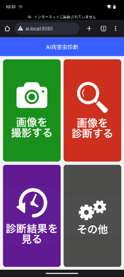
1. 画面の指示にしたがって、病虫害の種別・作物・部位を選択し、診断します。  
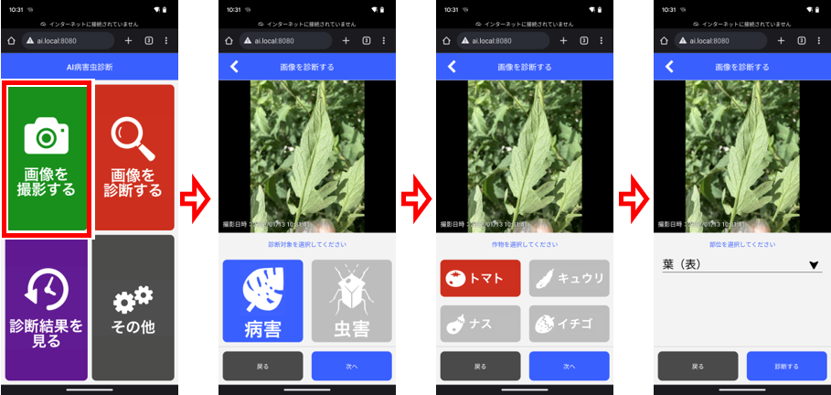
1. 診断結果が表示されます。  
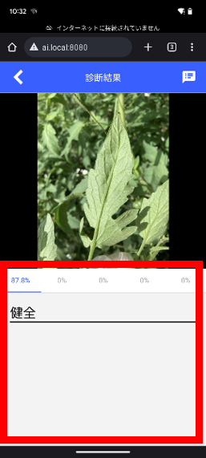
