# 識別AIの学習

ここでは、**作物・病害・対象病害虫の異なる、新たな識別AIを作成する手順**を説明します。

診断AI（画像識別モデル）は、Google Colaboratoy (https://colab.research.google.com; Google社が提供するクラウド開発環境) を用いて作成します。

Colaboratory では、深層学習用の計算装置として GPU や TPU が提供されています。
TPU は深層学習専用に設計された演算装置であり、このハードウェアを使うことで学習・推論を高速化することができます。
また、深層学習で広く用いられている GPU を用いた学習・推論も可能です。

学習後、Raspberry Pi モデルで動作するようにモデルを変換（軽量化）し、サーバに展開します。

## 用意するもの

* 学習用の JPEG 画像
  * 画像数は、1クラスあたり1000枚程度以上が望ましい
* Linux サーバ（データセットの作成用）
* Google アカウント

TPU で学習する場合は、下記も必要です：

* Google Cloud Platform (https://cloud.google.com; Google社が提供するクラウド環境) のアカウント

## 目次

1. 環境構築
1. データセットの作成
1. データセットのアップロード
1. モデルの学習
1. 学習済みモデルの評価
1. 学習済みモデルの変換（軽量化）
1. サーバへの展開

## 環境構築

Linux サーバに [Docker Engine](https://docs.docker.com/engine/) をインストールし、下記コマンドを実行します。

```console
$ cd /path/to/cloned/repo # このレポジトリのクローン先パス
$ docker build -t effnet effnetv2/
```

データセットの作成に用いる Docker イメージが作成されます。

## データセットの作成

### データセットのディレクトリ構造

このレポジトリのクローン先ディレクトリ (`naro_rasppi/`) に、学習・評価に使う画像を配置します。

下記のように、ディレクトリを作成・配置してください。

```
naro_rasppi/
    ...
    dataset/
        train/
            aburamushi/
                100000_20201231123456_01.JPG
                200000_20201223234501_01.JPG
                ...
            azamiuma/
                ...
            ...
        validation/
            aburamushi/
                300000_20201231123456_01.JPG
                400000_20201223234501_01.JPG
                ...
            azamiuma/
                ...
            ...

{train, validation}: train は学習用、validation は評価用のサブセットです。
{aburamushi, azamiuma, ...}: 画像が属するクラスです。クラスの名前やクラス数は、学習・評価サブセット間で同じにする必要があります。
```

データセットは、2種類の画像で構成されます：

* 学習用データ（`train/` ディレクトリ）
* 性能評価用データ（`validation/` ディレクトリ）

識別AIの学習は、学習用データだけを使って実施されます。
モデルの学習が終わったあと、性能評価用データを使ってモデルの評価が行われます。

学習用データと性能評価用データは、撮影条件が異なるデータ（撮影地・撮影日が異なる、など）を用いるようにしてください。
学習・評価に撮影条件が同じデータを使った場合、評価時にモデル本来の性能を正しく測定できない場合があります。

### TFRecord 形式への変換

学習前に、データセットを TFRecord 形式に変換（シリアル化）する必要があります。
このレポジトリ内にあるツール `effnetv2/imagenet_to_gcs.py` を使って変換します。

次のコマンドを実行します。

```console
$ cd /path/to/cloned/repo
$ bash effnetv2/convert_to_tfrecord.sh "$(pwd)" "$(pwd)/dataset"
```

変換が完了すると、`dataset/` ディレクトリ直下に `tfrecord/` ディレクトリが作成され、その下に TFRecord ファイルが作られます。

1つの TFRecord ファイルには、データセット内の画像が数十枚～数百枚ほど含まれます。生成される TFRecord ファイルの数は、データセットの画像数に応じて変化します。

```
naro_rasppi/
    ...
    dataset/
        tfrecord/
            synset_id2label.json
            train-00000-of-00016 <- 学習データを TFRecord 形式に変換したファイル
            train-00001-of-00016 <- 〃
            ...
            validation-00000-of-00016 <- 評価データを TFRecord 形式に変換したファイル
            validation-00001-of-00016 <- 〃
            ...
```

### データセットのアップロード

作成した TFRecord 形式のデータセットとメタデータ（`synset_id2label.json` など）を、クラウドでの学習のためにアップロードします。

アップロードするには、下記の2つの方法があります：

* Google Cloud Storage へのアップロード
* Google Drive へのアップロード

Google Cloud Storage を使用する場合、Google Cloud Platform のアカウントが必要です。

TPU で学習・評価する場合、データセットを Google Cloud Storage にアップロードする必要があります（Cloud Storage 以外の場所に置いたデータセットをTPUで読み込むことはできません）。

Google Drive には容量制限があります（2023-01-01 時点で、無料アカウントでは15GB）。
サイズの大きいデータセットをアップロードする場合は、Google Cloud Storage にアップロードしてください。

#### Google Cloud Storage へのアップロード

まず、データをクラウド上で格納するためのバケットを作成します。
バケットは、ローカルマシンのボリュームに相当するもので、ユーザが任意につけた名前で区別することができます。 

Google Cloud Platform では、バケットを `gs://my-bucket/` のように `gs://` を接頭辞とする URL で指定することがあります。
同様に、バケット内のファイルも `gs://my-bucket/path/to/synset_id2label.json` のように URL として表記することがあります。

バケットの作成方法は、[Google 公式ドキュメント](https://cloud.google.com/storage/docs/creating-buckets) を参照してください。

バケットを作成したら、[`gsutil`](https://cloud.google.com/storage/docs/gsutil) コマンドを使って、`tfrecord/` ディレクトリを Google Cloud Storage にアップロードします。

※ `gsutil` コマンドのインストール方法は、上記リンクを参照してください。

```console
$ gsutil -m cp -r /path/to/dataset/tfrecord gs://my-bucket/dataset
```

#### Google Drive へのアップロード

Google Drive にデータセットをアップロードする場合は、下記の手順でアップロードします。

1. [Google Drive](https://drive.google.com/) を開きます。
1. 任意のフォルダに移動し、`tfrecord/` ディレクトリの下に生成されたファイルをすべてドラッグ＆ドロップしてアップロードします。  
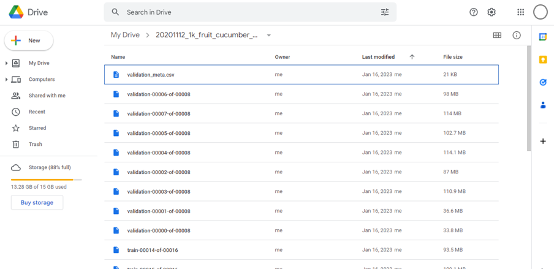


## モデルの学習

識別AIの学習には、Google Colaboratoy を利用します。

Google Colaboratory は、Jupyter ノートブックを実行可能なクラウド環境です。
プログラミング言語 Python で記述されたコードを、Google が提供するサーバ上で実行することができます。

### ノートブックのアップロード

このレポジトリには、学習・評価用のノートブック `effnetv2/effnetv2_tfhub.ipynb` が同梱されています。
このノートブックを用いて、画像識別AI [EfficientNetV2](https://arxiv.org/abs/2104.00298) の学習・評価ができます。 

学習・評価を実施するために、まずノートブックをアップロードします。

1. Google アカウントにログインしたブラウザで、[Google Colaboratory](https://colab.research.google.com) を開きます。
1. 「File」メニューから「Upload notebook」を選択します。  
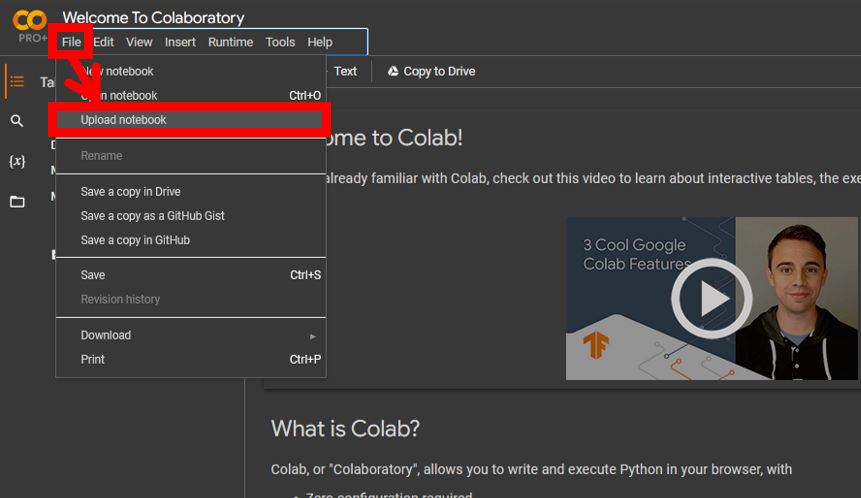
1. アップロード画面が開きます。`effnetv2/effnetv2_tfhub.ipynb` をアップロードします。  
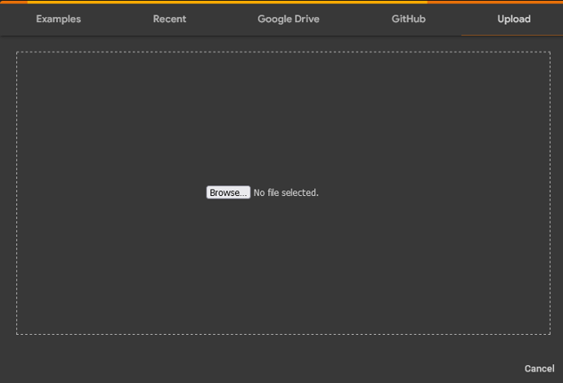
1. アップロードが完了すると、ノートブックが自動的に開きます。  
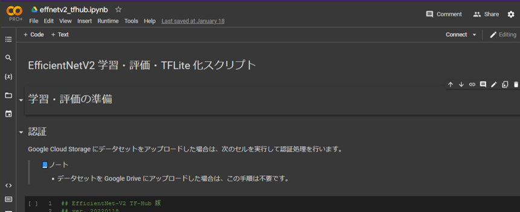
1. 学習・評価に用いるアクセラレータを設定します。「Runtime」メニューから「Change runtime type」を選択し、「Hardware accelerator」として「GPU」または「TPU」を選択します。
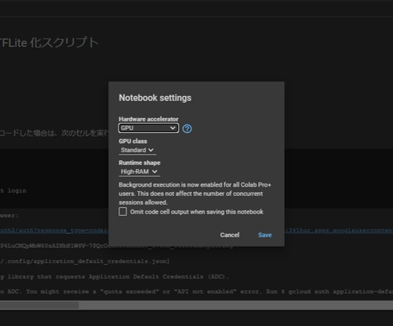
1. 仮想マシンが起動し、画面右上のマシンステータス表示がチェックマーク 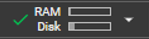 に変わります。
    > 📘ノート
    >
    > アクセラレータを選択しても仮想マシンが起動しない場合は、ステータス表示の「Connect」ボタンをクリックして、マシンを起動してください。

### 認証

Google Cloud Storage で学習する場合は、仮想マシン上で認証処理を行って、仮想マシンからクラウド上のデータにアクセスできるようにする必要があります。
下記の設定を行います。

> ️📘ノート
>
> * データセットを Google Drive にアップロードした場合は、この手順は不要です。
> * 設定は仮想マシンに保存されますが、仮想マシンは一定時間が経過すると削除されるため、仮想マシンを起動するたびに認証処理をする必要があります。

1. 「認証」という見出しの直下にあるセル（コードが書かれた四角形のブロック）の上にマウスを移動します。コード実行アイコン  が表示されるので、クリックしてセルのコードを実行します。
1. 認証トークンの入力を求めるメッセージが表示されます。表示されたURLをクリックして、認証を開始します。  
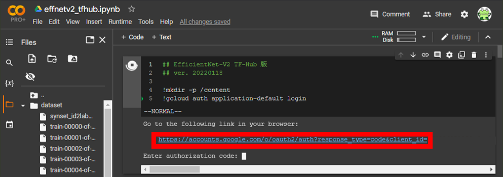
1. 別画面でアカウント選択を求められます。使用中の Google アカウントを選択します。  

1. 「Allow」をクリックします。  

1. 認証トークンが表示されます。トークンをコピーして、画面を閉じます。  
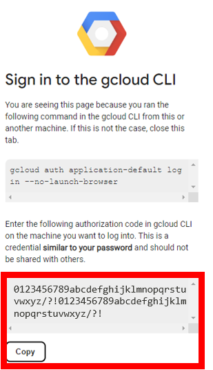
1. Colaboratory ノートブックに戻ります。セルの出力欄に、認証トークンを入力して Enter キーを押します。  
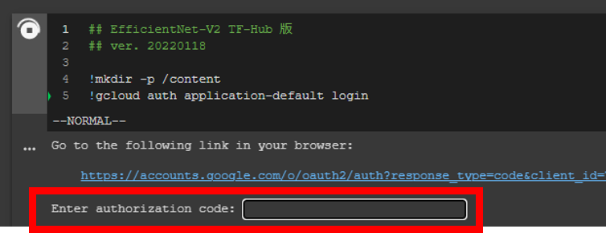

### Google Drive のマウント

Google Drive にデータをアップロードした場合は、学習・評価の前に、Google Drive を仮想マシンにマウントします。

1. ノートブック内の、見出し「Google Drive のマウント」の下にあるセルを実行します。
1. 許可を求めるダイアログが表示されます。「Connect to Google Drive」を押して、マウントを許可します。
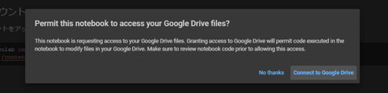
1. `/content/drive/MyDrive/` に、Google Drive がマウントされます。  
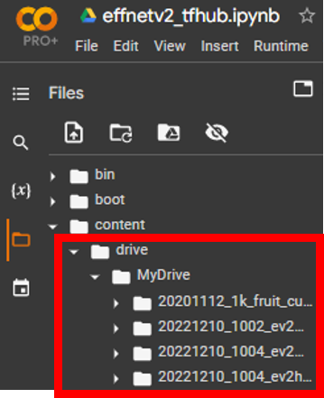

### 学習・評価の設定

続いて、データセットの URL や画像数などの設定を行います。

1. ノートブック内の、見出し「学習・評価の設定」の下にある設定セルに移動します。
1. セルの右側に表示されているフォームに、値を入力します。
各項目の詳しい設定方法は、フォーム上の説明をご参照ください。
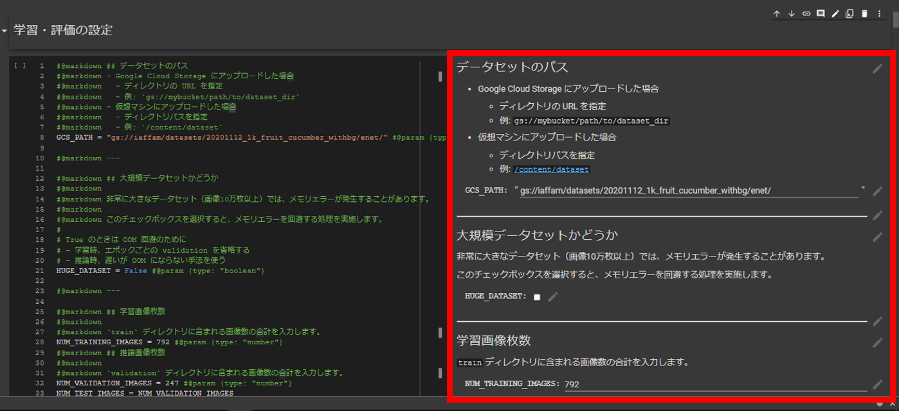
1. 設定セルを実行して、設定を適用します。セルを実行するには、を押します。
    > 📘ノート
    >
    > セルを選択した状態で `Shift + Enter` を押して、セルを実行することもできます。


### 学習の実行

1. 「学習・評価の設定」から「学習」までの各セルを、上から順に実行します。
1. 学習が始まると、学習セル（`model.fit` メソッドを実行するセル）に学習の進捗状況が表示されます。  
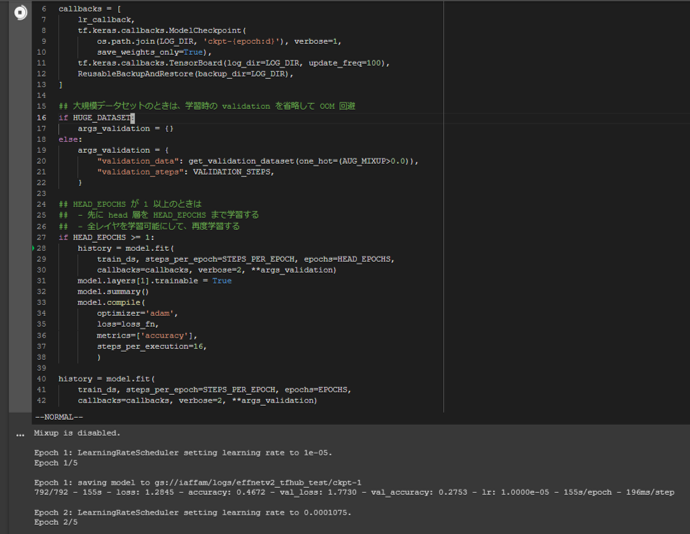
正しく学習できている場合のログは、下記のようになります：
    ```
    Mixup is disabled.

    Epoch 1: LearningRateScheduler setting learning rate to 1e-05.
    Epoch 1/5

    Epoch 1: saving model to gs://______/ckpt-1
    792/792 - 155s - loss: 1.2845 - accuracy: 0.4672 - val_loss: 1.7730 - val_accuracy: 0.2753 - lr: 1.0000e-05 - 155s/epoch - 196ms/step

    Epoch 2: LearningRateScheduler setting learning rate to 0.0001075.
    Epoch 2/5

    ...

    Model: "sequential"
    _________________________________________________________________
    Layer (type)                Output Shape              Param #   
    =================================================================
    lambda (Lambda)             (None, 512, 512, 3)       0         
                                                                    
    keras_layer (KerasLayer)    (None, 1280)              20331360  
                                                                    
    dense (Dense)               (None, 3)                 3843      
                                                                    
    =================================================================
    Total params: 20,335,203
    Trainable params: 20,181,331
    Non-trainable params: 153,872
    _________________________________________________________________

    Epoch 6: LearningRateScheduler setting learning rate to 0.000322.
    Epoch 6/30

    ...
    ```
学習の進捗状況は、エポック（epoch）の表示により確認できます。
エポック30が終了すると、学習が完了します。

## 学習済みモデルの評価

学習に引き続いて `validation` データを用いて学習済みモデルの成績を評価するときは、下記を実行します。

1. ノートブックの「学習済みモデルの評価」までの各セル（「学習」は除く）が実行されていない場合は、各セルを上から順に実行します。
1. 見出し「学習済みモデルの評価」の下にある、各セルを実行します。
1. `validation` データを使った評価が行われ、下記の結果が表示されます。
    * F1スコア、適合率（precision）、再現率（recall）
    * 混同行列 (CSV形式)
    * Top-1 精度（top-1 accuracy）
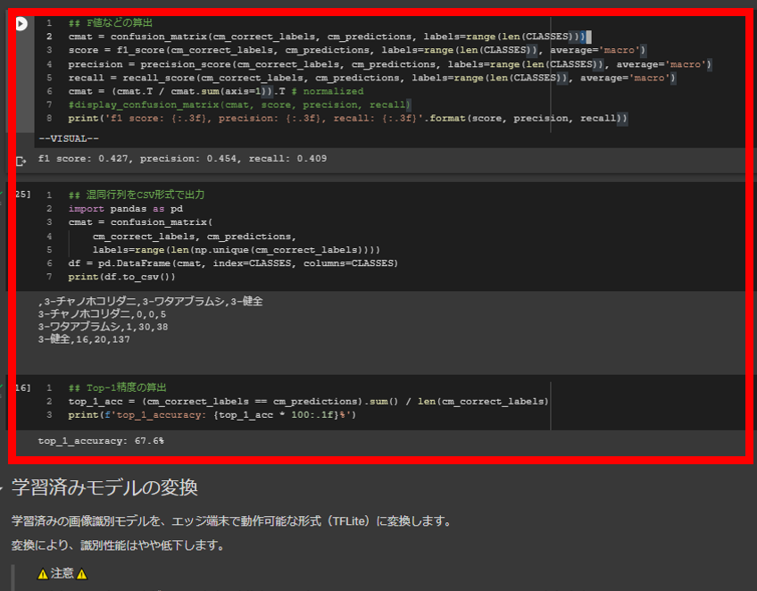


F1スコア、適合率、再現率、Top-1 精度は、いずれもモデルの性能を測る指標で、値が大きいほど性能がよいことを示します。

混同行列は、「どのクラスを」「どのクラスとして」「何件」検出したかを示す表です。
縦軸に正解ラベル、横軸に推論ラベルをとり、正解・推論ラベルの組みあわせごとの画像枚数を示しています。

## 学習済みモデルの変換（軽量化）

学習後、Raspberry Pi モデルで動作する形式（TFLite 形式）にモデルを変換（軽量化）します。

1. ノートブックの、「学習済みモデルの変換」までの各セル（「学習」「学習済みモデルの評価」は除く）が実行されていない場合は、各セルを上から順に実行します。
1. 見出し「学習済みモデルの変換」の下にある設定フォームに、TFLite モデルの書き出し先ファイルパスを指定します。
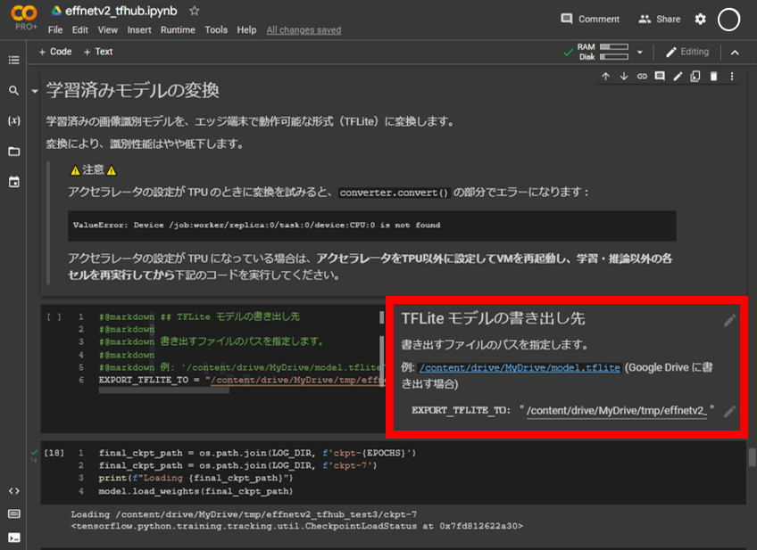
1. 設定したら、セルを実行して設定を適用します。
1. 設定フォーム以降のセルも、順に実行します。
1. 変換が完了すると、指定したファイルパスに TFLite モデルが書き出されます。Colab の画面左側のファイルツリー（）または Google Drive （下図）から、TFLite モデルをダウンロードします。  
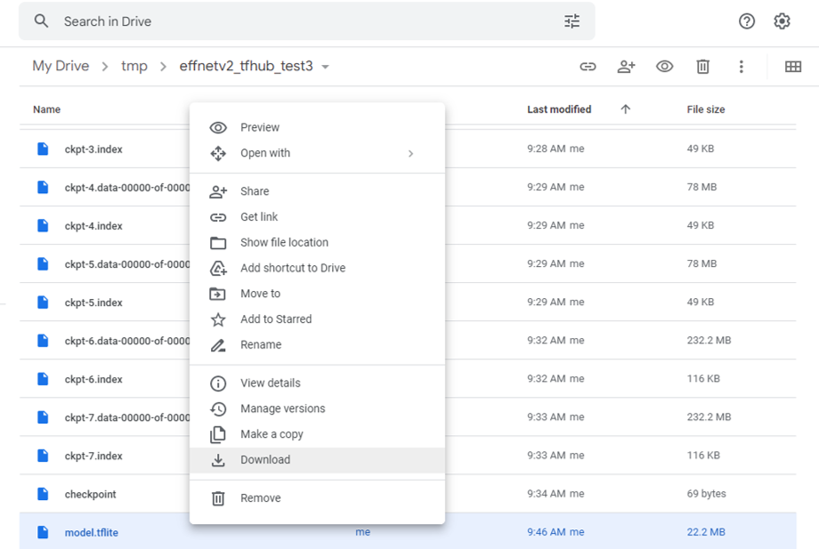

## サーバへの展開

軽量化モデル（`model.tflite`）とモデルのメタデータ（クラス名など）を可搬型識別装置に転送することで、新しいモデルを利用できるようになります。

1. 可搬型識別装置に SSH 接続します。
1. 新しいモデルの設置先ディレクトリを作成します。
    ```console
    $ # ソースコードを手動で展開した場合は、naro_rasppi までの
    $ # ディレクトリパスを適宜変更してください
    $ cd /home/naro-rasppi/naro_rasppi/ai/src/model/bin/
    $ mkdir my_model
    ```
1. ダウンロードした `.tflite` 形式のモデルを、作成したディレクトリに SCP 等で転送します。
1. 作成したディレクトリの中に、メタデータファイルをCSV形式で作成します。  
    * モデルの学習に使ったデータセットのディレクトリで、クラス名を昇順ソートしたときの順番で、メタデータを記載します。  
    たとえば、学習データ（`train/`）が下記のようになっているとします。
        ```console
        $ ls -1F dataset/train
        tomato_fruit_azamiuma/
        tomato_fruit_haiirokabibyo/
        tomato_fruit_healthy/
        ```
        この場合、クラス名を昇順ソートすると、下記のようになります。
        ```console
        tomato_fruit_azamiuma
        tomato_fruit_haiirokabibyo
        tomato_fruit_healthy
        ```
        したがって、メタデータファイルの1行目には `tomato_fruit_azamiuma` の情報、2行目には `tomato_fruit_haiirokabibyo` の情報、…というように記載します。
    * ファイルのフォーマットは、`model/bin/20221210_1004_ev2hub_ep3/classes.csv` を参照してください：
        ```console
        $ cat /home/naro-rasppi/naro_rasppi/ai/src/model/bin/20221210_1004_ev2hub_ep3/classes.csv
        作物,部位,病害虫の種別,クラス名
        トマト,果実,虫害,アザミウマ類
        トマト,果実,病害,灰色かび病
        トマト,果実,健全,健全

        ```
    * ここまでの手順が完了すると、ディレクトリ内は下記のようになります:
        ```console
        $ cd /home/naro-rasppi/naro_rasppi/ai/src/model/bin/
        $ ls my_model
        model.tflite   classes.csv
        ```
1. 新しいモデルを使って診断するように、識別装置の設定を変更します。
    ```console
    $ vi /home/naro-rasppi/naro_rasppi/ai/src/model/lib/efficientnetv2.py
    ```
    下記のとおりファイルを書き換えます:
    * `tflite_path`
        * 新しいモデル（`.tflite` 形式）のファイルパスに書き換え
        * ディレクトリパスは下記のとおり読み替え  
        `/home/naro-rasppi/naro_rasppi/ai/src` → `/var/www/maff_ai/src`
    * `classes_path`
        * 作成したメタデータ（`classes.csv`）のファイルパスに書き換え
        * ディレクトリパスは下記のとおり読み替え  
        `/home/naro-rasppi/naro_rasppi/ai/src` → `/var/www/maff_ai/src`
1. 下記コマンドで、サーバを再ビルドします。
    ```console
    $ cd /home/naro-rasppi/naro_rasppi
    $ docker compose down && docker compose up --build --detach
    ```
1. 再ビルドが完了すると、新しい識別AIを使って診断できるようになります。

以上
